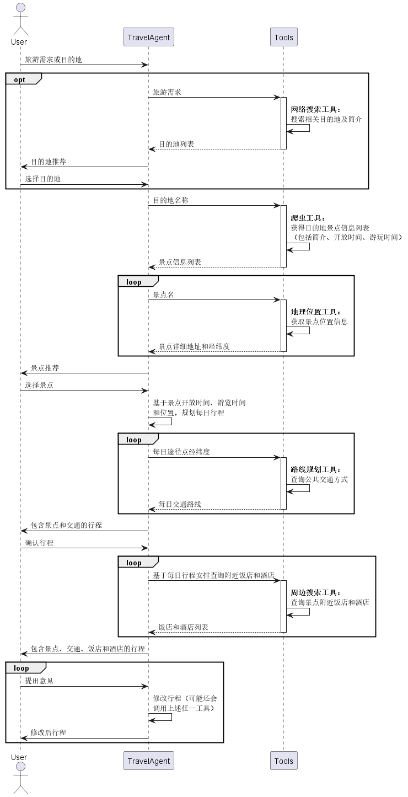

# 旅游规划机器人

## 简介

基于大模型智能规划旅游行程，包括景点搜索、交通查询、饭店酒店查询等功能。

## 基本工作流程

## 使用

1. 在`.env`中配置好各种 api key。
2. 由于网络搜索工具使用了 duckduckgo，在国内需要打开代理软件才能正常调用该工具执行搜索
3. 运行`main_async.py`或`main_sync.py`在控制台对话，运行`async_chat_demo.py`或`sync_chat_demo.py`在Gradio界面对话。不过`async_chat_demo.py`使用流式输出会导致大模型的工具调用和用户消息混在一起，效果不佳，推荐使用`sync_chat_demo.py`。